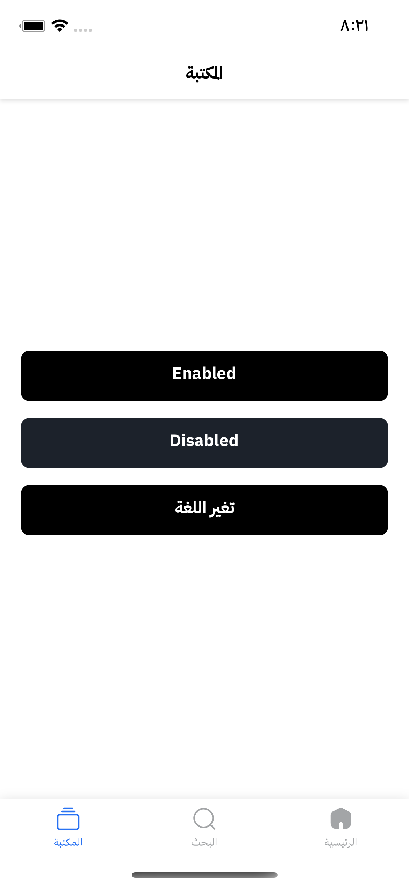
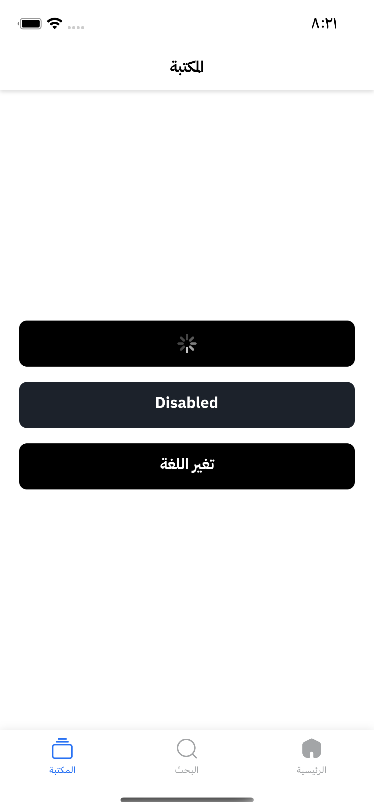
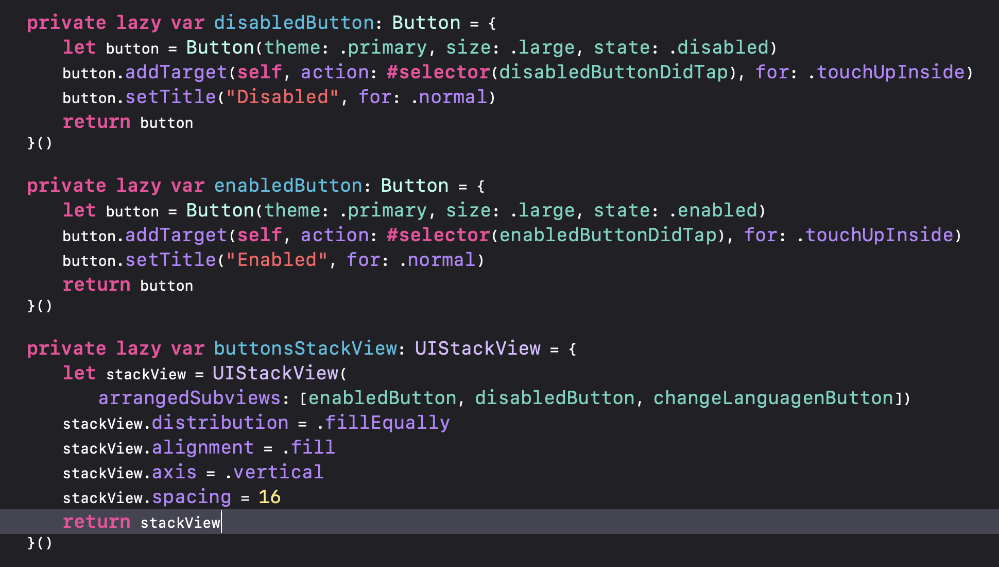
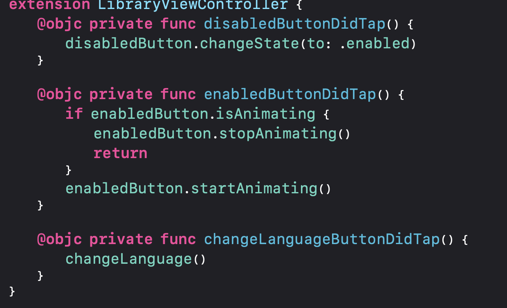

# ThmanyahUtilitiesKit

## How it works
The repository Contains `UtilitiesKit` Package that allows you to use Helper Extensions to make your coding more faster and efficient.
The repository Contains `EasyConstraints` Package that allows you to Desgin your screens by code.
The repository Contains `DesignSystem` Package allows you to use all the features of standard UIButton with a lot of new cool features, customizable from Storyboard or from code.

| Start Screen | Loading Screen |
| --- | --- |
|  |  |

First of all, Create a new Button inside your view controller.

| Button Creation | Button Action |
| --- | --- |
|  |  |


##### How to show the loader indicator
```
//Call `isAnimating` to check if Button is loading.
myButton.startAnimating()

//Hide loader
myButton.stopAnimating()
```

## Requirements

- iOS 14.0+
- Xcode 14+

## Setup
To get started, you need to have the ThmanyahUtilitiesKit package installed in your project please read this guidlines.

```
https://www.swiftlyrush.com/adding-a-swift-package-in-xcode/#:~:text=Open%20your%20Xcode%20project%2C%20navigate,URL%20to%20the%20Github%20page.
```
```
.package(url: "https://github.com/Moamenzalabia/ThmanyahUtilitiesKit.git", .Branch("master"))
```
